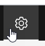
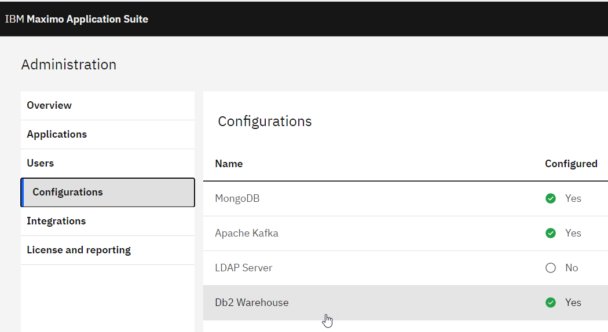
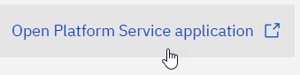
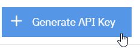
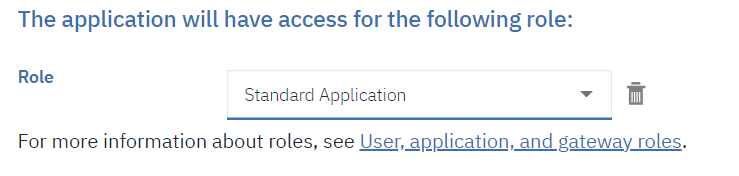

# **Creation of an OSI IoTFunction**

## Setup repository
* Clone locally the starter_package: `git clone https://github.com/ibm-watson-iot/functions -b starter_package osi_funcs`
* Create an empty (private) github repository (e.g. https://github.com/philippe-gregoire/osi_iotfuncs)
* Add remote: `git remote add osi_iotfuncs https://github.com/philippe-gregoire/osi_iotfuncs`
* Push remote: `git push --repo osi_iotfuncs`
> Your repo now has a `osi_iotfuncs` branch

## Test sample function
Here we use VSCode to edit the IoTFunction, and a Anaconda environment for python 3.7.6.  

### Setup a python env.
* Install Anaconda python distro, version 3.7.6 (you can use plain python too)
* Create a conda environment `conda env create -n masmon_py376 python=3.7.6`
* Activate that env: `conda activate masmon_py376``
* Install the MAS IoTFunction for version 8.3.1 in that env: `pip install git+git://github.com/ibm-watson-iot/functions@mas-831 --upgrade`. This should also fulfill the dependencies.

### Setup VSCode
* Start VSCode on your e.g. `osi_iotfuncs` folder.

### Align sample *`HelloWorld`* function
* You may want to change the module name from `custom` to something else, e.g. `mas_hello`, for this rename the `custom` dir (using `git mv` command), and change the name in `setup.py`
* Modify the IoTFunction name in `functions.py` to e.g. `PhG_HelloWorld`
* Generate a Personal Access Token for your Git account (in `https://github.com/settings/tokens`)
* Set the `PACKAGE_URL` to your own it repo's URL, including the `@starter_package`, and the token, e.g.:
``` python
token='60eca2a7442059ea7ac0e410651892cf9e32ca3a'
PACKAGE_URL = f"git+https://{token}@github.com/philippe-gregoire/osi_iotfuncs@starter_package"
```

### Get credentials's config `.json` file for AS Monitor
We will need to get the credentials from MAS's Monitor Analytics Service and DB2WH.
This should be assembled into a `credentials_as_dev.json` file, placed in `scripts\` and structured as:
``` json
{
    "tenantId": "MAS",
    "_db_schema": "MAS_MAM",
    "db2": {
        "username": "user1017",
        "password": "<db2_pw>",
        "databaseName": "BLUDB",
        "security": true,
        "port": 32635,
        "httpsUrl": "https://compute8.ocp1-bsc.nca.ihost.com:32635",
        "host": "compute8.ocp1-bsc.nca.ihost.com"
    },
    "iotp": {
        "asHost": "api.home.mas.apps.ocp1-bsc.nca.ihost.com",
        "apiKey": "<api_key>",
        "apiToken": "<api_token>"
    }
}
```

#### Database credentials and certificates
The DB2WH data is accessible from the MAS admin, using the gear icon at the top right , then navigating to **Configurations** and **Db2 Warehouse**.

Copy the relevant fields into `credentials_as.json`, namely:
 * `username`
 * `password`
 * `databaseName`, should be *`BLUDB`*
 * `port`
 * `host`
In addition, the following values must be added:
 * `security` set to value *`true`*
 * `httpsUrl` should be set to the above `host` value with `https://` prefix

##### Test Database connectivity using *DBeaver*
To use DBeaver to connect to the Monitor DB2WH, use the credentials and add `sslConnection` property with value `true`, and add the DB2WH server certificate to the DBBeaver's JDK TrustStore.
>* One way to obtain the certificate is by going into the DB2 running pod, the other one is to use FireFox and point to the JDBC endpoint URL, which will prompt for to accept and inspect the certificate (of course the protocol after accepting is not HTTP so that will fail, but you will have the opportunity to capture the server certificate)
>* Another way is to use
`openssl s_client -connect compute8.ocp1-bsc.nca.ihost.com:32635 -showcerts`
>* To display a certificate file contents, use e.g.:
`openssl x509 -in ibm-com.pem -text`

DBeaver's certificate store is in e.g. `C:\Program Files\DBeaver\jre\lib\security\cacerts`, to list the contents, run e.g.:
```
"C:\Program Files\DBeaver\jre\bin\keytool.exe" -list -storepass changeit -cacerts
```
To add the db2 certificate, run e.g.:
```
"C:\Program Files\DBeaver\jre\bin\keytool.exe" -import -trustcacerts -storepass changeit -cacerts -alias db2-ibm-com-cert -file ibm-com.pem
```
(You may need to restart DBBeaver to take into account the changes to `cacerts`)
In the DB2WH catalog, you'll find the `tenantId_MAM` and the `IOTANAYTICS` schemas for Monitor, and the `IOTP_*` for WIoTP. The API Keys are stored in the `APIKEYS` table.

> Note: When using DB2 with self-signed server certificate in the Monitor/AS API, the certificate has to be provided to the connection.
> To do so, the certificate has to be placed in a file named `db2_certificate.pem` in the current directory, or the environment variable `DB_CERTIFICATE_FILE` has to be set to point to that certificate file.
> The certificate file is obtained by using the command
`openssl s_client -connect compute8.ocp1-bsc.nca.ihost.com:32612 -showcerts>rootCA_32612.pem`
and keeping the second certificate from that file (i.e. the CA Root's)

#### Monitor Analytics Service APIKey credentials
The Analytics Service API Key is obtained from the secrets of the .

Copy the key and authentication token to the `credentials_as_dev.json` file.
>> Note that the AS credentials section needs to be named `"iotp"` and not `"as"` as stated in the documentation!

Specify the `asHost` to the api endpoint, e.g. `mas.api.monitor.mas.apps.ocp1-bsc.nca.ihost.com`

#### Optional: IOTP credentials:
If you need an IoTP API Key, you can navigate to it from the main MAS Monitor interface's connect tab (https://mas.monitor.mas.apps.ocp1-bsc.nca.ihost.com/connect), then following the *Open PLatform Service application*  link .    
Then go to the apps tab at e.g. https://mas.iot.mas.apps.ocp1-bsc.nca.ihost.com/dashboard/apps/browse, and select **Generate API Key** .
Select role Standard Application  and generate the key.

#### Test AS API connectivity
If you have an Entity defined, you can issue the following CURL command:
```
curl -X GET --insecure -H "x-api-key: kN7VsFPTMO8-zHmavvHm4lbePZgoXiJd2M72h6lYVcA" -H "x-api-token: SSSe2ZgkL9q8md9T53BBOpVDjqZdGmJeouPtp6ysGAw" https://mas.api.monitor.mas.apps.ocp1-bsc.nca.ihost.com/api/images/v1/mas/entityType/SAMPLE_ROBOT_TYPE
```

IoT platform swagger interface is at e.g. https://mas.iot.mas.apps.ocp1-bsc.nca.ihost.com/docs/v0002/device-mgmt.html

#### Test AS Python API
>> Note: When using self-signed HTTPs certificates for the MAS host, in order to get the python API to work, the server certificate should be added to the `certifi` Python package.
>> Alternatively, you can patch `iotfunctions\db.py` around line 396 to discard server certificate verification, replace `'CERT_REQUIRED'` with `'CERT_NONE'`
``` python
self.http = urllib3.PoolManager(timeout=30.0, cert_reqs='CERT_NONE', ca_certs=certifi.where())
```
This project's `scripts` folder contains a `create_TestEntity.py` that can be used to create a new Entity in Monitor. The credentials are taken from a file named `credentials_as_<USERNAME>.json`, where `<USERNAME>` is the value of the `USERNAME` environment variable.

### Test and Deploy the IoTFunction
