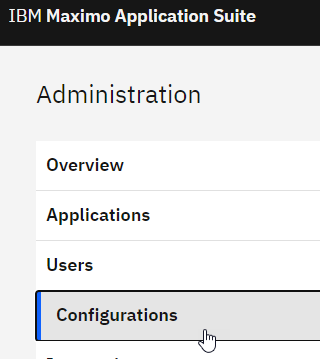
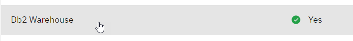
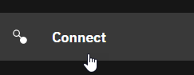
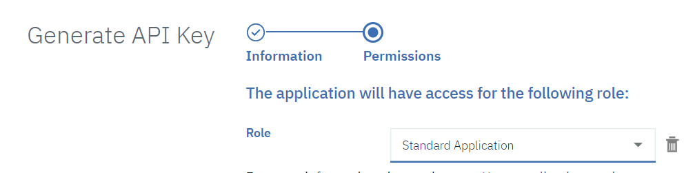

# Installation instructions for Maximo Monitor OSIPi Connector
-----

This document guides the user through the installation and configuration of the OSIPi Connector for MAS's Monitor component.

The goal is to create a MAS Monitor Entity which reflects some sensor data collected in an OSI Pi Vision Server, accessed through its API.

##A. Preparing the IoTFunction
The OSIPi Connector IoTFunction will need to be installed onto MAS' Monitor.

###1. Accessing the IoTFunction code
This is a one-time operation that needs to be performed from a local clone of the Git repository, whose `scripts\` directory contains installation utilities.
```
git clone https://github.com/philippe-gregoire/mas_iotfuncs
```
will create a `mas_iotfuncs` directory on you local filesystem.

###2. Collecting required access credentials
The setup utility functions will need to have access to the MAS Monitor instance in order to deploy the IoTFunctions to it, and also optionally to the OSIPi server to introspect the data structures in order to gather configuration data.

#### MAS Monitor DB2 credentials
1. In your repository clone's directory, make a copy of the `scripts\credentials_as.json` file into a file named `credentials_as_%USERNAME%.json`, on Windows. If running from Linux/Mac, set an environment variable named `USERNAME` first.
1. From the MAS Monitor home page (e.g. https://mas82.monitor.apps.<domain>/home), navigate to the administrative interface (Gear button at the top right ).
1. Select the `Configurations` tab 
1. Select the `DB2 Warehouse` tab 
1. Copy the DB2 connection data to the `credentials_as__%USERNAME%.json` file.
1. The `tenantId` is normally the prefix of your Monitor URL, e.g. `mas82` if the URL starts with `mas82.monitor.apps.*`. The DB Schema used by monitor will be `_db_schema`=`<tenantId>_MAM`, e.g. `MAS82_MAM`
   > Note: if you are using self-signed certificates, to access the MAS DB from a java-based tool, e.g. DBBeaver,  you will need to add the DB2 certifcate to the JRE, with e.g.: *`"C:\Program Files\DBeaver\jre\bin\keytool.exe" -import -trustcacerts -storepass changeit -cacerts -alias db2-ibm-com-cert -file DB2_cert_32635.pem`*. The `.pem` certificate file can be obtained by running the *`scripts\getDB2Cert.py`* utility.

#### MAS Monitor API credentials
The second section of the credentials file is built as such:
1. Set `asHost` to the API endpoint, e.g. `mas82.api.monitor.apps.<domain>` if `mas82` is your **tenantID**.
1. The `apiKey` and `apiToken` need to be gathered from the OpenShift admin, following instructions in https://www.ibm.com/docs/en/maximo-monitor/8.3.0?topic=monitor-connection-parameters
1. >___Validation___:  To validate the `credentials_as_%USERNAME%.json` file, you can execute the `scripts/test_OSIPiPreload.py info` command, which will dump the list of entities defined in Maximo Monitor.

#### MAS Connect IoT credentials (optional)
This is not required for this installation, but for reference, the Connect (IoT Platform) API key and token are managed independently, to get them you would:
1. From the Monitor UI, select the `Connect` tab button 
1. Select the `Open Platform Service application` from the top right: 
1. Select the `Apps` tab button 
1. Select `Generate API Key` 
1. Select permission of **Standard Application** 
1. Generate the key and token, keep the values safe as the token cannot be recovered

#### OSIPi PIServer credentials
1. From the `scripts` directory, make a copy of the sample `credentials_osipi.json` file, into a file with your current **USERNAME** as suffix, i.e. `credentials_osipi_%USERNAME%.json`.
1. Fill-in the values of the OSIPi PIServer running the API endpoint, `pihost` & `piport` and the connection credentials `piuser` & `pipass`.
1. >___Validation___:  To validate the `credentials_osipi_%USERNAME%.json` file, you can execute the `scripts/TestOSIPIAPI.py list -elements` command, which list the Elements defined OSIPi, and `scripts/TestOSIPIAPI.py list -points`, which will list the Points defined.


## Creating a Maximo Monitor Entity as a twin of a OSIPi Element
This section assumes that you have gathered the connectivity parameters in the two `credentials_as_%USERNAME%.json`and `credentials_osipi_%USERNAME%.json` files.
