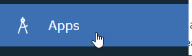

# Installation instructions for Maximo Monitor OSIPi Connector
-----

This document guides the user through the installation and configuration of the OSIPi Connector for MAS's Monitor component.

The goal is to create a MAS Monitor Entity which reflects some sensor data collected in an OSI Pi Vision Server, accessed through its API.

##A. Preparing the IoTFunction
The OSIPi Connector IoTFunction will need to be installed onto MAS' Monitor.

###1. Accessing the IoTFunction code
The setup tools are implemented as python scripts, running from a local copy of the git repository:
* A supported Python environment will be required, typically Python 3.7.6 or above. You may want to create an anaconda or python or virtual environment.

* The Git repository local clone is a one-time operation that needs to be performed, whose `scripts\` directory contains installation utilities and setup tools:
  ```
  git clone https://github.com/philippe-gregoire/mas_iotfuncs
  ```
  will create a `mas_iotfuncs` directory on you local filesystem.

* MAS IoTFunctions python dependencies need to be installed:
  ```
  pip install iotfunctions@git+https://github.com/ibm-watson-iot/functions.git@production
  ```

###2. Collecting required access credentials
The setup utility functions will need to have access to the MAS Monitor instance in order to deploy the IoTFunctions to it, and also optionally to the OSIPi server to introspect the data structures in order to gather configuration data.

#### MAS Monitor DB2 credentials
1. In your repository clone's directory, make a copy of the `scripts\credentials_as.json` file into a file named `credentials_as_%USERNAME%.json`, on Windows. If running from Linux/Mac, set an environment variable named `USERNAME` first.
1. From the MAS Monitor home page (e.g. https://mas82.monitor.apps.<domain>/home), navigate to the administrative interface (Gear button at the top right ).
1. Select the `Configurations` tab 
1. Select the `DB2 Warehouse` tab 
1. Copy the DB2 connection data to the `credentials_as__%USERNAME%.json` file.
1. The `tenantId` is normally the prefix of your Monitor URL, e.g. `mas82` if the URL starts with `mas82.monitor.apps.*`. The DB Schema used by monitor will be `_db_schema`=`<tenantId>_MAM`, e.g. `MAS82_MAM`
   > Note: if you are using self-signed certificates, to access the MAS DB from a java-based tool, e.g. DBBeaver,  you will need to add the DB2 certifcate to the JRE, with e.g.: *`"C:\Program Files\DBeaver\jre\bin\keytool.exe" -import -trustcacerts -storepass changeit -cacerts -alias db2-ibm-com-cert -file DB2_cert_32635.pem`*. The `.pem` certificate file can be obtained by running the *`scripts\getDB2Cert.py`* utility.

#### MAS Monitor API credentials
The second section of the credentials file is built as such:
1. Set `asHost` to the API endpoint, e.g. `mas82.api.monitor.apps.<domain>` if `mas82` is your **tenantID**.
1. The `apiKey` and `apiToken` need to be gathered from the OpenShift admin, following instructions in https://www.ibm.com/docs/en/maximo-monitor/8.3.0?topic=monitor-connection-parameters
1. >___Validation___:  To validate the `credentials_as_%USERNAME%.json` file, you can execute the `scripts/test_OSIPiPreload.py info` command, which will dump the list of entities defined in Maximo Monitor.

#### MAS Connect IoT credentials (optional)
This is not required for this installation, but for reference, the Connect (IoT Platform) API key and token are managed independently, to get them you would:
1. From the Monitor UI, select the `Connect` tab button 
1. Select the `Open Platform Service application` from the top right: 
1. Select the `Apps` tab button 
1. Select `Generate API Key` 
1. Select permission of **Standard Application** 
1. Generate the key and token, keep the values safe as the token cannot be recovered

#### OSIPi PIServer credentials
1. From the `scripts` directory, make a copy of the sample `credentials_osipi.json` file, into a file with your current **USERNAME** as suffix, i.e. `credentials_osipi_%USERNAME%.json`.
1. Fill-in the values of the OSIPi PIServer running the API endpoint, `pihost` & `piport` and the connection credentials `piuser` & `pipass`.
1. >___Validation___:  To validate the `credentials_osipi_%USERNAME%.json` file, you can execute the `scripts/TestOSIPIAPI.py list -elements` command, which list the Elements defined OSIPi, and `scripts/TestOSIPIAPI.py list -points`, which will list the Points defined.

## Creating a Maximo Monitor Entity as a twin of a OSIPi Element
This section assumes that you have gathered the connectivity parameters in the two `credentials_as_%USERNAME%.json`and `credentials_osipi_%USERNAME%.json` files.

### Selecting the parent Element from OSIPi
We assume that the Entity type we want to create from Elements has several instances as children Element nodes, with the same attributes structure.
#### Finding the path to the parent Element
You can use the `scripts/TestOSIPIAPI.py list -elements -pathprefix "\\path\" -attributes` to find out the parent path, below which instances of the Entity will be present.

For example `scripts\TestOSIPIAPI.py list -elements -pathprefix "\\OSISOFT-SERVER\IBM_FabLab\FabLab_Paris\Motor" -attributes` could show 3 `Bearings` instances below. The last part of the path after the parent will be used as the instance ID.

One you have identified your parent Element, you can use the following command to show the attribute structure and optionally dump the values to a CSV file:
```
scripts\TestOSIPIAPI.py test -elements -parent_element "\\OSISOFT-SERVER\IBM_FabLab\FabLab_Paris\Motor" -to_csv
```

### Creating the OSIPi Element twin Entity in Maximo Monitor
We will use the information gathered above to create a matching Entity Type in Monitor.

This time, we will use the following command:
```
scripts\test_OSIPiPreload.py create -elements -parent_element "\\OSISOFT-SERVER\IBM_FabLab\FabLab_Paris\Motor" -entity_type Bearing
```
After which you will have a new Entity Type defined in Maximo Monitor:


### Adding OSIPi Element as a Preload data source for the Entity
We will register an IoTFunction in Maximo Monitor, which will be used to preload (i.e. load at the beginning of the Analytics Service pipeline) data from OSIPi into Entities

#### Register OSIPi Elements Preload functions
The function is called `PhGOSIElemsPreload`, to register it with your Maximo Monitor instance, use the following command:
```
scripts\test_OSIPiPreload.py register -elements
```
This is a one-time setup operation

#### Configure the PhGOSIElemsPreload for the entity_type
1. From Maximo Monitor dashboard, select the Monitor tab button 
1. Open your target Entity Type 
1. Switch to the `Data` tab 
1. Click the *Create New* `[+]` button 
1. Type a filter in the search field, e.g. `PhG` 
1. Select the `PhGOSIElemsPreload` function 
1. Enter the connectivity information:
   * `date_field` should be set to `date`
   * `osipi_host`, `ospi_port`, `osipi_user` and `osipi_pass` copied from `credentials_osipi` file.
   * `parent_element_path` should be the same as the one tested previously
   
1. Click `[Next]`, accept the defaults and finally click `[Create]` 

The function will kick-off every 5 minutes as part of the Analytics Service pipeline processing, and will start to populate sensor data for the children Elements of the specified `parent_element_path`
